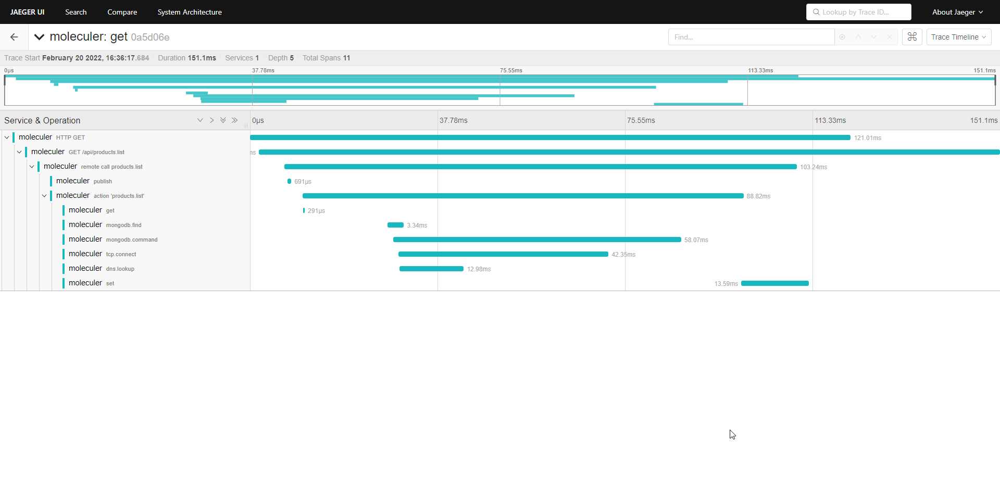

[](https://moleculer.services)

# moleculer-opentelemetry-demo
This is a [Moleculer](https://moleculer.services/)-based microservices project with a tracing middleware for [OpenTelemetry](https://opentelemetry.io/).

## Usage
Start a Redis and MongoDB server on localhost. 
Start a Jaeger server on localhost.

### Start Moleculer
As monolith
```
npm run dev
```

or as microservices
```
npm run dev:api &
npm run dev:svc
```

### Make a request
Open http://localhost:3000/api/products.list

### Check the trace in Jaeger


